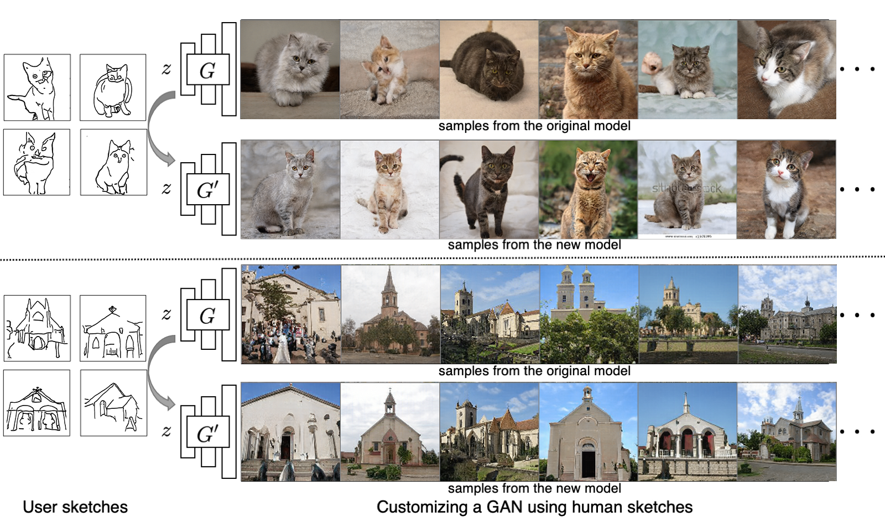

# GANSketching in Jittor

Implementation of ([Sketch Your Own GAN](https://arxiv.org/abs/2108.02774)) in [Jittor(计图)](https://github.com/Jittor/Jittor).

Original repo: [Here](https://github.com/PeterWang512/GANSketching).

## Notice
We have tried to match official implementation as close as possible, but we may still miss some details. If you find any bugs when using this implementation, feel free to submit issues.

## Results

Our implementation can customize a pre-trained GAN to match input sketches like the original paper.



### Training Process

Training process is smooth.


## Getting Started

### Clone our repo

```bash
git clone TODO
cd GANSketching
```

### Install packages
- Install Jittor: Please refer to https://cg.cs.tsinghua.edu.cn/jittor/download/.
- Install other requirements:

  ```bash
  pip install -r requirements.txt
  ```

### Download model weights

- Run `bash weights/download_weights.sh` to download author's pretrained weights, or download our pretrained weights from [here](https://cloud.tsinghua.edu.cn/d/d6c57f33b7784533af61/).
- Feel free to replace all the `.pth` checkpoint filenames to `.jt` ones.


### Generate samples from a customized model

This command runs the customized model specified by `ckpt`, and generates samples to `save_dir`.

```
# generates samples from the "standing cat" model.
python generate.py --ckpt weights/photosketch_standing_cat_noaug.pth --save_dir output/samples_standing_cat

# generates samples from the cat face model in Figure. 1 of the paper.
python generate.py --ckpt weights/by_author_cat_aug.pth --save_dir output/samples_teaser_cat

# generates samples from the customized ffhq model.
python generate.py --ckpt weights/by_author_face0_aug.pth --save_dir output/samples_ffhq_face0 --size 1024 --batch_size 4
```

### Latent space edits by GANSpace

Our model preserves the latent space editability of the original model. Our models can apply the same edits using the latents reported in Härkönen et.al. ([GANSpace](https://github.com/harskish/ganspace)).

```
# add fur to the standing cats
python ganspace.py --obj cat --comp_id 27 --scalar 50 --layers 2,4 --ckpt weights/photosketch_standing_cat_noaug.pth --save_dir output/ganspace_fur_standing_cat

# close the eyes of the standing cats
python ganspace.py --obj cat --comp_id 45 --scalar 60 --layers 5,7 --ckpt weights/photosketch_standing_cat_noaug.pth --save_dir output/ganspace_eye_standing_cat
```

## Model Training

Training and evaluating on model trained on PhotoSketch inputs requires running [the Precision and Recall metric](https://github.com/kynkaat/improved-precision-and-recall-metric). The following command pulls the submodule of the forked Precision and Recall [repo](https://github.com/PeterWang512/precision_recall).

```bash
git submodule update --init --recursive
```

### Download Datasets and Pre-trained Models

The following scripts downloads our sketch data, our evaluation set, [LSUN](https://dl.yf.io/lsun), and pre-trained models from [StyleGAN2](https://github.com/NVlabs/stylegan2) and [PhotoSketch](https://github.com/mtli/PhotoSketch).

```bash
# Download the sketches
bash data/download_sketch_data.sh

# Download evaluation set
bash data/download_eval_data.sh

# Download pretrained models from StyleGAN2 and PhotoSketch
bash pretrained/download_pretrained_models.sh

# Download LSUN cat, horse, and church dataset
bash data/download_lsun.sh
```

To train FFHQ models with image regularization, please download the [FFHQ dataset](https://github.com/NVlabs/ffhq-dataset) using this [link](https://drive.google.com/file/d/1WvlAIvuochQn_L_f9p3OdFdTiSLlnnhv/view?usp=sharing). This is the zip file of 70,000 images at 1024x1024 resolution. Unzip the files, , rename the `images1024x1024` folder to `ffhq` and place it in `./data/image/`.


### Training Scripts

The example training configurations are specified using the scripts in `scripts` folder. Use the following commands to launch trainings.

```bash
# Train the "horse riders" model
bash scripts/train_photosketch_horse_riders.sh

# Train the cat face model in Figure. 1 of the paper.
bash scripts/train_teaser_cat.sh

# Train on a single quickdraw sketch
bash scripts/train_quickdraw_single_horse0.sh

# Train on sketches of faces (1024px)
bash scripts/train_authorsketch_ffhq0.sh

# Train on sketches of gabled church.
bash scripts/train_church.sh

# Train on sketches of standing cat.
bash scripts/train_standing_cat.sh
```

The training progress is tracked using `wandb` by default. To disable wandb logging, please add the `--no_wandb` tag to the training script.

### Evaluations

Please make sure the evaluation set and model weights are downloaded before running the evaluation.

```
# You may have run these scripts already in the previous sections
bash weights/download_weights.sh
bash data/download_eval_data.sh
```

Use the following script to evaluate the models, the results will be saved in a csv file specified by the `--output` flag. `--models_list` should contain a list of tuple of model weight paths and evaluation data. Please see `weights/eval_list` for example.

```
python run_metrics.py --models_list weights/eval_list --output metric_results.csv
```

## Related Works

- R. Gal, O. Patashnik, H. Maron, A. Bermano, G. Chechik, D. Cohen-Or. ["StyleGAN-NADA: CLIP-Guided Domain Adaptation of Image Generators."](https://arxiv.org/abs/2108.00946). In ArXiv. (concurrent work)
- D. Bau, S. Liu, T. Wang, J.-Y. Zhu, A. Torralba. ["Rewriting a Deep Generative Model"](https://arxiv.org/abs/2007.15646). In ECCV 2020.
- Y. Wang, A. Gonzalez-Garcia, D. Berga, L. Herranz, F. S. Khan, J. van de Weijer. ["MineGAN: effective knowledge transfer from GANs to target domains with few images"](https://arxiv.org/abs/1912.05270). In CVPR 2020.
- M. Eitz, J. Hays, M. Alexa. ["How Do Humans Sketch Objects?"](http://cybertron.cg.tu-berlin.de/eitz/pdf/2012_siggraph_classifysketch.pdf). In SIGGRAPH 2012.
